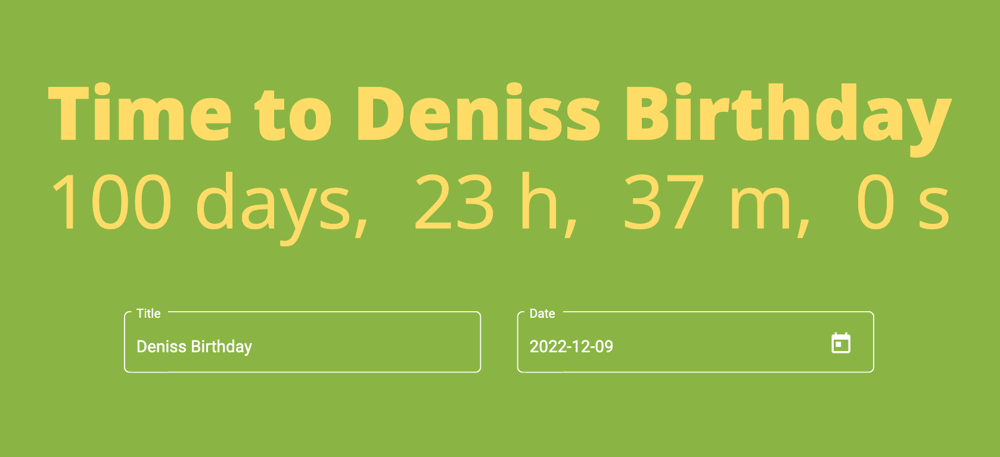
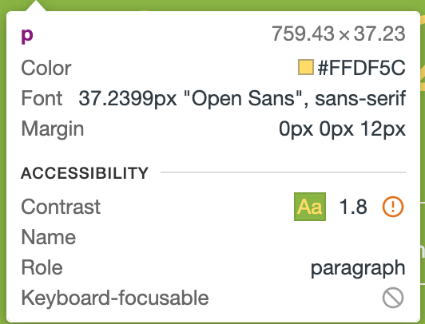
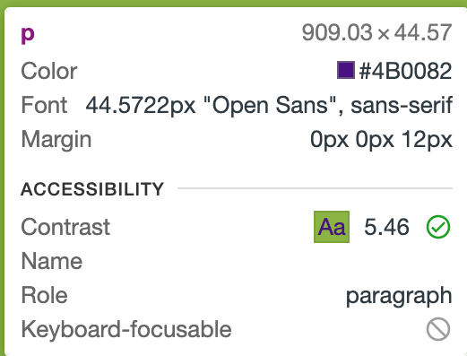

# NaturalCycles

## Development server

Run `ng serve` for a dev server. Navigate to `http://localhost:4200/`. The application will automatically reload if you change any of the source files.

## Build

Run `ng build` to build the project. The build artifacts will be stored in the `dist/` directory.

## Running unit tests

Run `ng test` to execute the unit tests via [Karma](https://karma-runner.github.io).

## What can be improved

- The app could be covered with more precise unit tests
- The color scheme could be changed because of accesibility problems (font color and background have low contrast) (consider the call with designer)

